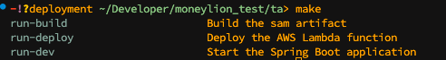

# Moneylion Technical Assessment

# Stack

The backend uses Java Spring Boot, with a PostgreSQL database created in AWS RDS 
and deployed using AWS Lambda and can be accessed using the API Gateway [endpoint]('https://e16awp2iu7.execute-api.us-east-1.amazonaws.com/Prod/').

To check the commands available, run `make` in the terminal.

    

## Models

The backend consists of three models with its respective tables:

- [User](./src/main/java/com/moneylion/ta/model/User.java) Model:
    - Represents a simplified user model, with the fields `id`, `username` and `email`.

- [Feature](./src/main/java/com/moneylion/ta/model/Feature.java) Model:
    - Represents features that can be accessed by user, with the fields `id`, `name` and `description`.

- [UserFeature](./src/main/java/com/moneylion/ta/model/UserFeature.java) Model:
    - Model that links a user to features, and sets access to the respective features, with its own field `enable`.

- [UserFeatureRequest](./src/main/java/com/moneylion/ta/model/UserFeatureRequest.java) Model:
    - A DTO for user used to parse body in requests.

## Repositories

Each model consists of its own CRUD operations, using repositories that CrudRepository:

- [User Repository](./src/main/java/com/moneylion/ta/repository/UserRepository.java):
    
    - Handles the general CRUD operations.

- [Feature Repository](./src/main/java/com/moneylion/ta/repository/FeatureRepository.java):
    
    - Handles the general CRUD operations.

- [UserFeature Repository](./src/main/java/com/moneylion/ta/repository/UserFeatureRepository.java):

    - Handles the general CRUD operations, with additional functions:
    
        * canAccess that checks whether user can access the feature.

        * findByUserEmailAndFeatureName that retrieves a UserFeature object based on the email and feature name.
    
## Service

A seeder [script](./src/main/java/com/moneylion/ta/service/SeedingService.java) is set up to seed the PostgreSQL database with 5 users and features respectively. To seed, uncomment the seedData function in [main](./src/main/java/com/moneylion/ta/TaApplication.java) file with the `spring.jpa.hibernate.ddl-auto=create` in application properties configuration, while commenting out `spring.jpa.hibernate.ddl-auto=none`. 

## Deployment

The api is deployed using AWS Lambda in an API Gateway with the using the [template.yaml](./template.yaml) script.

# ml_test
